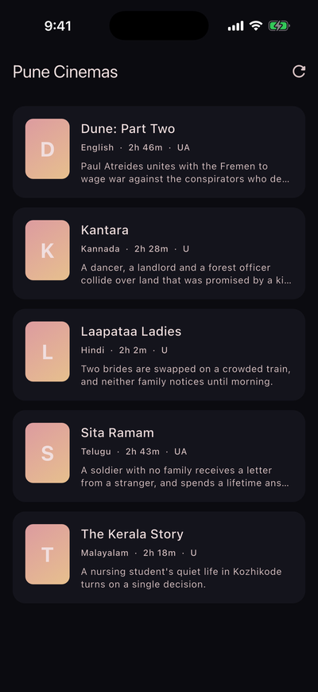
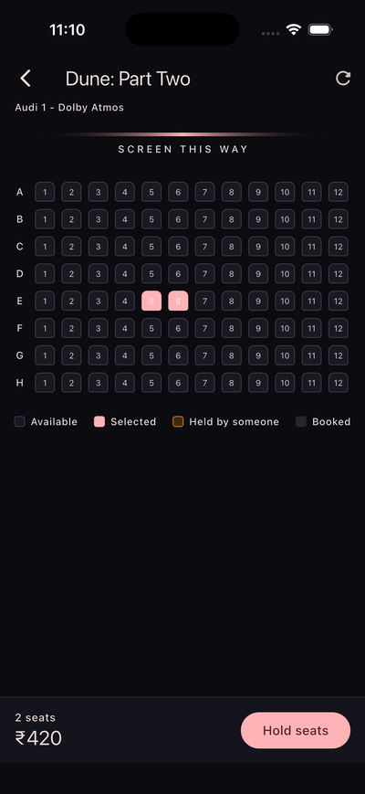
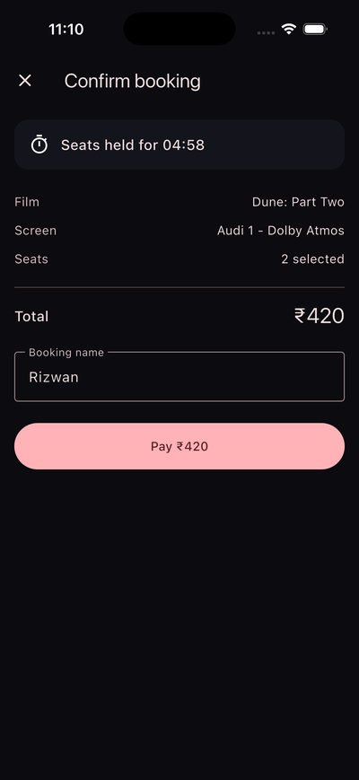
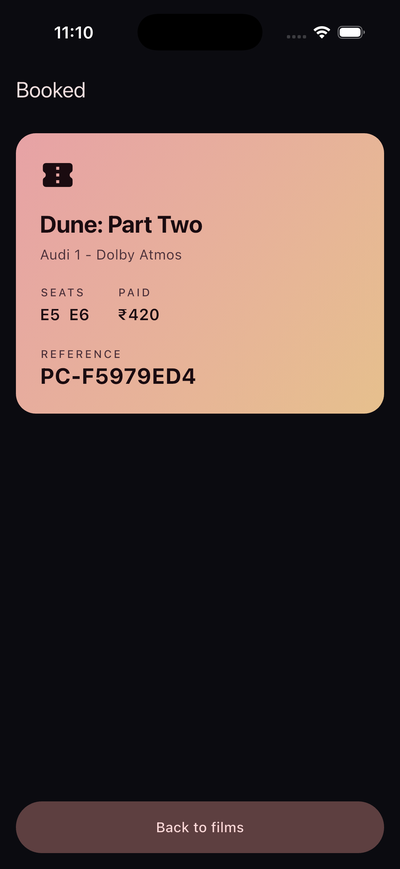
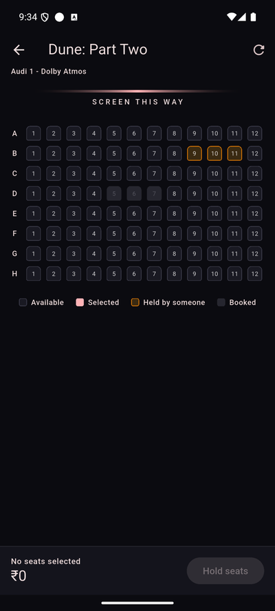
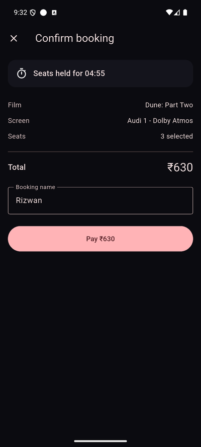
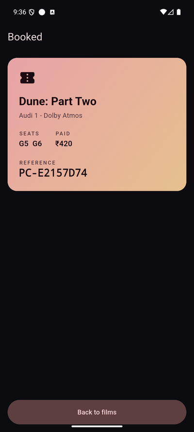

# Showtime — Pune Cinemas

[](https://github.com/rizwan-dev/showtime/actions/workflows/ci.yml)


A cinema ticket-booking system: a **Ktor** API in Kotlin on **PostgreSQL**, and a
**Flutter** app that runs on **iOS and Android**. Browse films, pick seats, hold
them for five minutes while you pay, and get a ticket — with the seat-hold
guarantees enforced by the database, not by hope.

| iOS | | | |
|:-:|:-:|:-:|:-:|
|  |  |  |  |
| **Android** | | | |
|  |  |  | |

## Status

| Check | Result |
|---|---|
| API tests | 13 passing, against real PostgreSQL (Testcontainers) |
| App tests | 15 passing, `flutter analyze` clean |
| CI | Both suites on every push and pull request |
| iOS | Full flow on the iPhone 17 simulator (iOS 26.3) against the live API |
| Android | Full flow on an Android emulator against the live API |

## Contents

- [The problem worth solving](#the-problem-worth-solving)
- [Design decisions](#design-decisions)
- [Getting started](#getting-started)
- [API](#api)
- [Testing](#testing)
- [Verified on devices](#verified-on-devices)
- [Two bugs the tests caught](#two-bugs-the-tests-caught)
- [Project layout](#project-layout)

## The problem worth solving

Listing films and tapping seats is the easy half, and most tutorials stop there.
A ticketing system lives or dies on **the hold**: picking a seat reserves it for
five minutes while you pay. Three properties have to be true at once, and they
pull against each other.

**Two people tap seat A5 at the same instant — exactly one gets it.**
A unique index over unreleased holds makes the second insert collide in the
database, instead of the application checking first and writing second. A
20-thread test asserts exactly one winner.

**An expired hold frees its seat immediately, with no sweeper.**
A background job that dies must never lock a seat forever. Postgres cannot index
on `now()`, so "live" cannot sit in the index predicate. Taking a hold is an
`INSERT ... ON CONFLICT DO NOTHING`, preceded by releasing lapsed holds, in one
transaction. Availability asks `expires_at > now()`, so a seat comes back the
instant its hold lapses.

**Confirming a hold that expired a millisecond ago fails — before money moves.**
Reading the hold, deciding it is valid, then inserting the booking leaves a
window in which someone else takes the seat and the customer pays for a seat they
do not have. So the expiry check is a `WHERE` clause on the insert itself: if the
hold lapsed, nothing is inserted and the caller is told so.

Underneath it all, `UNIQUE (show_id, seat_id)` on `booking_seats` means that
whatever the application believes, the database will not accept the same seat
twice.

## Design decisions

- **409 and 410 mean different things.** "Someone else has those seats" invites
  picking again; "your hold ran out" does not mean the seats are gone — they are
  very likely still free. The app uses different words for each, and a third for
  "the server did not answer", because telling a customer their seats went when
  the API is simply down would be a lie.
- **The countdown runs against the server's absolute deadline,** not a duration
  the client counts locally. A sleeping phone, a slow network or a wrong device
  clock would otherwise desynchronise the timer, and the customer would only find
  out when confirmation fails for no visible reason.
- **Held is not booked.** A held seat has its own colour: somebody has it *for
  now*, and a customer who waits a moment may well get it.
- **Holding is all or nothing.** Winning three seats out of four is worse than
  winning none — the customer cannot use them, and nobody else can either until
  they expire.
- **Money is integer paise everywhere,** formatted in Indian grouping
  (₹1,00,000, not ₹100,000). A floating-point total would add rounding error to a
  number the server already computed exactly.
- **Unusual ports on purpose.** 8080 and 5432 are the two most likely to be taken
  on a developer's machine, so the API uses 9193 and Postgres 55433.

## Getting started

### Prerequisites

- Docker (for PostgreSQL and the API)
- Flutter 3.47
- Xcode with an iOS simulator runtime matching its SDK (for iOS), or the
  Android SDK with an emulator (for Android)

### 1. Start the database and API

```bash
docker compose up --build        # PostgreSQL on 55433, API on 9193
curl localhost:9193/health       # {"status":"UP"}
```

On start-up Flyway applies the schema, and an empty database is seeded with
demo films and shows.

### 2. Run the app

```bash
cd app
flutter pub get
flutter run                      # pick an iOS simulator or Android emulator
```

The app reaches the API at `localhost:9193` on iOS and `10.0.2.2:9193` on the
Android emulator (the emulator's address for the host machine); the switch is in
`app/lib/api.dart`.

## API

| Method | Path | Purpose |
|---|---|---|
| `GET` | `/health` | Liveness check |
| `GET` | `/api/movies` | Films now showing |
| `GET` | `/api/shows?movieId=` | Shows, optionally for one film |
| `GET` | `/api/shows/{id}/seats` | Seat map with each seat's state |
| `POST` | `/api/shows/{id}/holds` | Hold seats — `201`, or `409` if any are taken |
| `DELETE` | `/api/holds/{token}` | Release a hold — `204` |
| `POST` | `/api/bookings` | Confirm a hold — `201`, or `410` if it expired |
| `GET` | `/api/bookings/{reference}` | Look up a booking |

## Testing

```bash
cd api && ./gradlew test         # 13 tests, against real PostgreSQL
cd app && flutter test           # 15 tests
```

The Kotlin tests use Testcontainers rather than an in-memory stand-in. Every
guarantee here is a database guarantee — a unique index, an `ON CONFLICT`
takeover, `now()` evaluated server-side — and a fake would only be testing the
fake.

## Verified on devices

**Over HTTP:** hold `201`, a second holder `409`, confirm `201`, re-confirming
the same hold `410 Gone`, holding a booked seat `409`.

**iOS** (iPhone 17 simulator, iOS 26.3, against the API from
`docker compose`): browsed films and shows, selected E5–E6, held them with the
countdown running, paid, and received reference `PC-F5979ED4`; the API then
returned that booking with seats E5 and E6 and ₹420 paid.

**Android** (emulator, against the live API): picked D5–D7, the hold appeared as
a countdown and the server independently reported those seats `HELD`; paying
returned reference `PC-1F0DCCE0`, and the server then reported them `BOOKED`
with no holds left. Holding seats from a *separate* client showed them on the
phone in the "held by someone" colour while booked seats stayed grey — all four
seat states correct at once, from two different clients.

## Two bugs the tests caught

**The takeover destroyed its own evidence.** The first version used
`ON CONFLICT DO UPDATE` to reuse the row, overwriting the previous holder's
token. The customer whose hold had just lapsed then got "no such hold" instead
of "your hold expired" — a worse message, and the history was gone. Now the
lapsed row is marked released and a new row inserted.

**The test container died halfway through the suite.** An `@AfterAll` stopping a
shared Testcontainer runs when the *first* test class finishes, leaving every
later class without a database. Separately, a connection pool per test that was
never closed exhausted Postgres around test twelve — and "too many clients"
points at the database rather than at the leak.

## Project layout

```
api/    Ktor 3.1 · Kotlin · PostgreSQL 16 · Flyway · HikariCP · 13 tests
  src/main/kotlin/…/booking/   holds, confirmation, error mapping
  src/main/resources/db/       Flyway schema migrations
app/    Flutter 3.47 · Dart · 15 tests
  lib/screens/                 films, shows, seat map, checkout, ticket
docs/screenshots/              images used in this README
```

The schema builds on the Pune Cinemas data layer from
[cinema-booking](https://github.com/RizTech-Academy/cinema-booking), which has
the constraints but no service layer.
